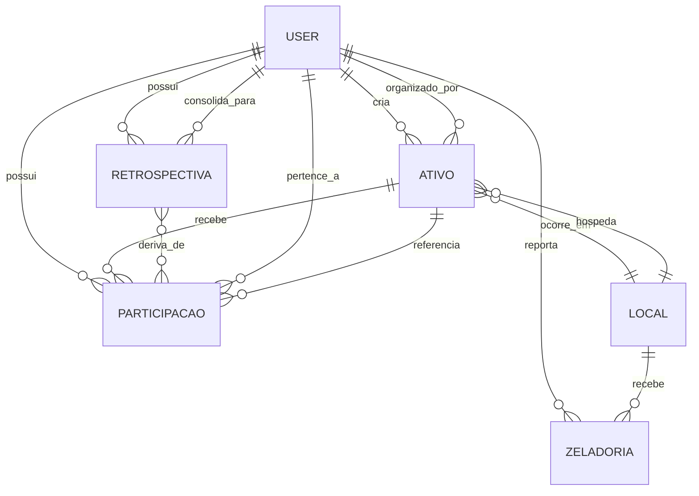
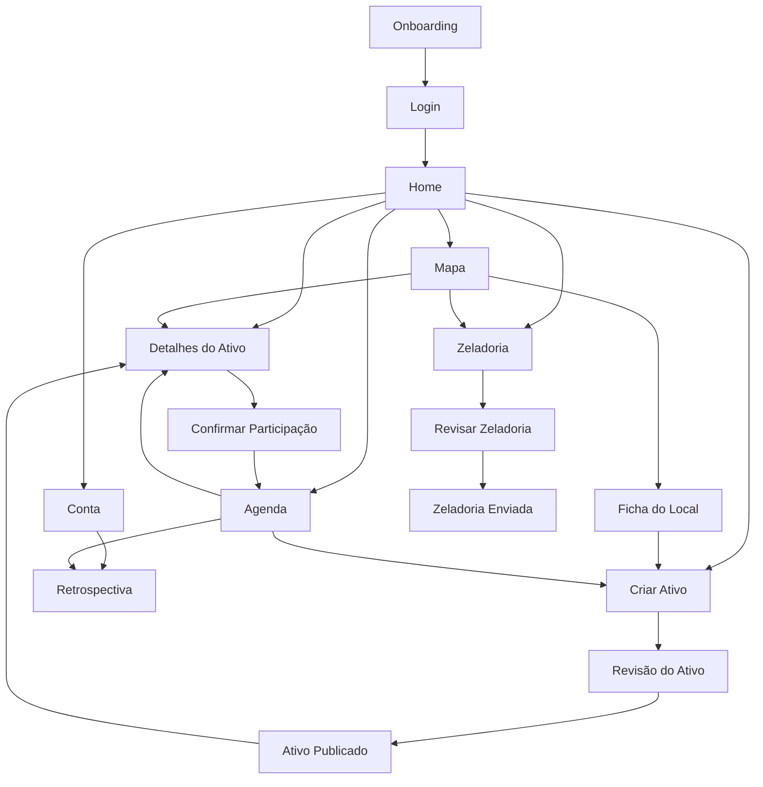
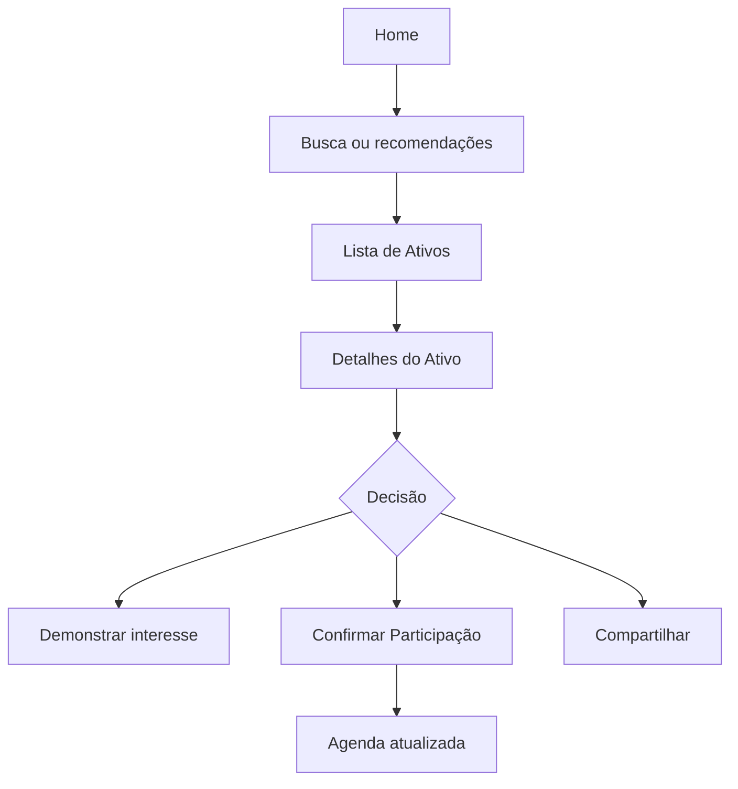
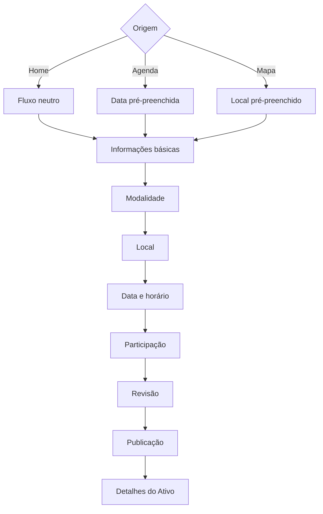
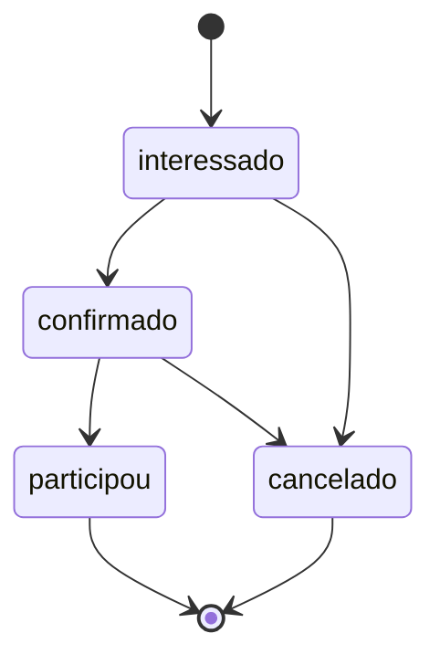
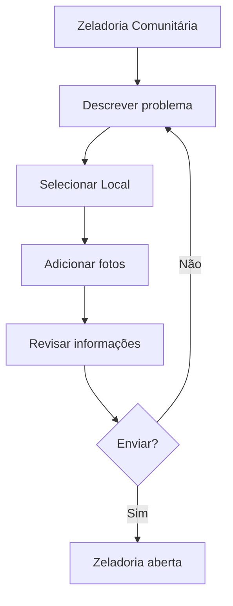
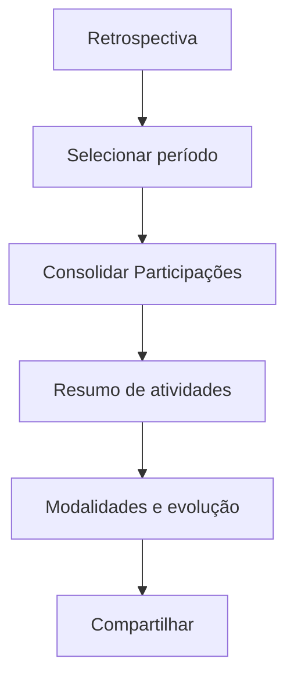
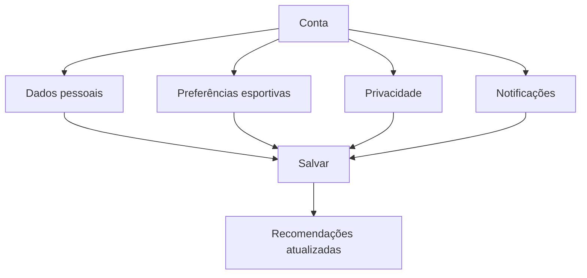

# IlhAtiva - Architecture Manifest

Este documento é a fonte oficial de verdade para a refatoração completa do IlhAtiva.

Ele consolida o domínio de negócio, a arquitetura de páginas, a experiência desenhada no Figma e as limitações do sistema legado. Qualquer implementação futura deve obedecer à seguinte prioridade de decisão:

1. `README.md`
2. `Pages.md`
3. `generated/figma.json`
4. Código legado

O sistema atual deve ser considerado legado. Seus nomes, rotas e entidades só devem ser reaproveitados quando estiverem alinhados ao domínio oficial.

## 1. Visão do Produto

O IlhAtiva é uma plataforma comunitária para descoberta, organização e participação em práticas esportivas e recreativas. Seu propósito é reduzir barreiras de acesso ao esporte conectando pessoas, locais e oportunidades reais de prática.

A entidade central do produto é o **Ativo**. Todo recurso principal deve fortalecer a descoberta, criação, participação, acompanhamento ou memória de Ativos.

### Problema Que Resolve

Pessoas interessadas em praticar esportes frequentemente não sabem onde ir, com quem praticar, quais locais estão disponíveis ou como organizar uma atividade coletiva. Ao mesmo tempo, espaços públicos esportivos precisam de uso, visibilidade e manutenção comunitária.

O IlhAtiva resolve esse problema ao:

- tornar Ativos próximos e relevantes descobríveis;
- permitir que qualquer pessoa organize uma prática esportiva;
- conectar Ativos a Locais reais;
- registrar Participações para gerar histórico e engajamento;
- permitir reportes de Zeladoria para manter os espaços utilizáveis;
- transformar participação em memória por meio da Retrospectiva.

### Objetivos Do Produto

- Aumentar a prática esportiva comunitária.
- Facilitar a criação de oportunidades esportivas.
- Organizar a vida esportiva do usuário no tempo e no espaço.
- Incentivar participação recorrente.
- Apoiar a conservação de Locais usados pela comunidade.
- Transformar dados de participação em motivação pessoal e social.

### Princípios De UX

- **Ativo no centro:** a navegação, os CTAs e os fluxos devem conduzir à descoberta, criação ou participação em Ativos.
- **Mobile-first:** a experiência oficial desenhada no Figma usa telas de 412x917; a implementação deve partir desse contexto.
- **Criação transversal:** Criar Ativo deve estar disponível na Home, Agenda e Mapa, com pré-preenchimentos contextuais.
- **Baixa fricção:** participar, criar e reportar devem exigir poucos passos visíveis, com revisão antes de ações importantes.
- **Contexto antes de formulário:** quando o usuário vem do Mapa, o Local deve vir preenchido; quando vem da Agenda, a data deve vir preenchida.
- **Comunidade e cuidado:** Zeladoria é um fluxo comunitário, não administrativo.
- **Memória como motivação:** Retrospectiva deve transformar participação em reconhecimento, progresso e compartilhamento.

## 2. Modelo De Domínio

### User

Representa uma pessoa cadastrada na plataforma.

Responsabilidades:

- criar Ativos;
- participar de Ativos;
- configurar preferências esportivas;
- reportar Zeladorias;
- consultar Retrospectiva;
- gerenciar dados pessoais, privacidade e notificações.

**Restrições:**

- User não armazena Ativos.
- User não armazena Participações.
- User não armazena Zeladorias.
- User não armazena Retrospectiva.

Esses dados são derivados através das entidades próprias (Ativo, Participacao, Zeladoria, Retrospectiva) utilizando o `userId` como referência.

#### Atributos

##### Identity (Identificação e Perfil)

- `id`: Identificador único do usuário
- `nome`: Nome completo
- `foto`: URL da foto/avatar
- `email`: Endereço de email (usado para login)
- `telefone`: Número de telefone
- `dataNascimento`: Data de nascimento
- `genero`: Gênero (masculino, feminino, nao_informado, outros)
- `bio`: Biografia/descrição pessoal

##### Preferences (Preferências Esportivas)

- `preferenciasEsportivas`: Array de modalidades favoritas (ex: ['corrida', 'futebol', 'yoga'])
- Utilizado para recomendações personalizadas na Home e filtros

##### Social (Relacionamentos)

- `amizades`: Lista de IDs de usuários amigos (futuro)
- `bloqueios`: Lista de IDs de usuários bloqueados (futuro)
- `convites`: Convites pendentes (futuro)

##### Settings (Configurações)

- `configuracoesPrivacidade`: Objeto com configurações de privacidade
  - `perfilPublico`: Boolean - Visibilidade do perfil
  - `compartilharRetrospectiva`: Boolean - Permitir compartilhamento de retrospectiva
- `configuracoesNotificacao`: Objeto com configurações de notificação
  - `lembreteAtivo`: Boolean - Lembretes de ativos
  - `novidadesLocais`: Boolean - Novidades em locais
- `idioma`: Idioma preferido (futuro, default: 'pt-BR')
- `tema`: Tema da interface (futuro, default: 'claro')

##### Metadata (Metadados)

- `isDemo`: Boolean - Indica se é usuário demo
- `isAdmin`: Boolean - Indica se é administrador
- `status`: Status da conta (ativo, inativo, suspenso)
- `createdAt`: Data de criação
- `updatedAt`: Data de última atualização

#### Demo Session

O conceito de Demo Session permite que a aplicação funcione sem autenticação real durante desenvolvimento e demonstração.

Regras:

- existe apenas um `currentUser` ativo por sessão;
- `currentUser` vive apenas em memória (React State);
- ausência de login utiliza o usuário demo administrador;
- cadastro cria um novo User apenas na memória;
- login altera `currentUser` apenas na memória;
- reiniciar a aplicação restaura a sessão demo.

Usuário Demo:

- `id`: 'user-demo-admin'
- `nome`: 'Usuário Demo'
- `email`: 'demo@ilhaativa.dev'
- `isDemo`: true
- `isAdmin`: true

### Ativo

Representa qualquer oportunidade organizada de prática esportiva ou recreativa que reúna pessoas em um Local e horário específicos.

Ativo não é apenas um evento. É uma oportunidade de ativação esportiva.

Responsabilidades:

- organizar uma prática esportiva;
- reunir participantes;
- ocupar um Local;
- gerar engajamento comunitário;
- alimentar Agenda e Retrospectiva.

### Participacao

Representa a relação entre um User e um Ativo.

Responsabilidades:

- registrar interesse;
- confirmar presença;
- cancelar presença;
- registrar participação efetiva;
- alimentar histórico e Retrospectiva.

### Local

Representa um espaço físico onde Ativos podem acontecer.

Exemplos:

- quadras;
- praças;
- praias;
- trilhas;
- centros esportivos;
- academias parceiras.

Responsabilidades:

- contextualizar Ativos geograficamente;
- permitir descoberta pelo Mapa;
- receber reportes de Zeladoria;
- indicar disponibilidade, estrutura e acessibilidade.

### Zeladoria

Representa um reporte comunitário sobre um problema em um Local.

Responsabilidades:

- registrar problemas que impactam o uso de Locais;
- permitir acompanhamento de status;
- preservar a qualidade dos espaços esportivos;
- apoiar a comunidade e o poder público na manutenção dos Locais.

### Retrospectiva

Representa uma consolidação histórica da prática esportiva de um User.

Responsabilidades:

- resumir Ativos participados;
- apresentar modalidades praticadas;
- calcular horas ativas;
- destacar Locais visitados, novos contatos e conquistas;
- incentivar retorno e compartilhamento.

### Relacionamentos

## 3. Glossário Oficial

### Termos Oficiais

**Ativo:** oportunidade organizada de prática esportiva ou recreativa em um Local e horário específicos.

**Participacao:** vínculo entre User e Ativo. Pode indicar interesse, confirmação, participação efetiva ou cancelamento.

**Local:** espaço físico onde Ativos acontecem e onde Zeladorias podem ser reportadas.

**Zeladoria:** reporte comunitário de problema relacionado a um Local.

**Retrospectiva:** resumo histórico e motivacional da participação esportiva de um User.

**Modalidade:** tipo de prática esportiva ou recreativa, como futebol, basquete, vôlei, trilha, corrida, natação, ciclismo ou yoga.

**Organizador:** User responsável pela criação e publicação de um Ativo.

**Participante:** User vinculado a um Ativo por uma Participacao.

**Agenda:** visão temporal dos Ativos do usuário e oportunidades em datas específicas.

**Mapa:** visão espacial de Locais e Ativos próximos.

### Termos Proibidos Ou Legados

Os termos abaixo não devem aparecer na arquitetura de domínio, rotas novas, textos principais ou entidades alvo. Caso existam no legado, devem ser tratados apenas como nomes técnicos antigos a migrar.

- `Booking`
- `Reservation`
- `Activity`
- `Event`
- `Court` como entidade central
- `RepairRequest`
- `EventLobby`
- `Agendamento` como conceito principal

Equivalências de migração:

- `Booking` ou `Reservation` -> `Participacao` ou estado temporal de `Ativo`, conforme o caso.
- `Activity` ou `Event` -> `Ativo`.
- `Court` -> `Local` com categoria `quadra`.
- `RepairRequest` -> `Zeladoria`.
- `EventLobby` -> recurso social futuro associado a `Ativo`, não entidade central.

## 4. Arquitetura De Navegação

A navegação principal deve refletir a centralidade do Ativo.

Estrutura principal:

- Home
- Mapa
- Criar Ativo
- Agenda
- Conta

Criar Ativo é a ação central e deve ter destaque visual superior às demais opções. No Figma, isso aparece como botão central/circular no componente `Menu`.

### Home

Porta de entrada para descoberta esportiva.

Responsabilidades:

- saudação;
- busca global;
- Ativos próximos;
- Ativos baseados em preferências;
- Locais em alta;
- Ativos em destaque;
- CTA transversal para Criar Ativo.

### Mapa

Exploração geográfica de Locais e Ativos.

Responsabilidades:

- exibir mapa interativo;
- listar Locais cadastrados;
- mostrar Ativos próximos;
- permitir filtros e busca;
- abrir ficha do Local;
- iniciar Criar Ativo com Local pré-preenchido.

### Agenda

Organização temporal da prática esportiva.

Responsabilidades:

- calendário mensal;
- Ativos do dia;
- próximos Ativos;
- histórico recente;
- iniciar Criar Ativo com data pré-preenchida.

### Criar Ativo

Fluxo transversal para publicação de novo Ativo.

Responsabilidades:

- receber contexto opcional de origem;
- coletar informações básicas, modalidade, local, data, horário e participação;
- revisar dados;
- publicar Ativo.

### Detalhes Do Ativo

Página de decisão e participação.

Responsabilidades:

- apresentar título, descrição, organizador, Local, data, horário, participantes, regras e recomendações;
- permitir demonstrar interesse;
- confirmar Participacao;
- cancelar Participacao;
- compartilhar Ativo.

### Zeladoria

Fluxo comunitário para reportar e acompanhar problemas em Locais.

Responsabilidades:

- listar reportes;
- criar reporte em etapas;
- revisar antes de enviar;
- acompanhar status.

### Retrospectiva

Resumo histórico e motivacional.

Responsabilidades:

- exibir período;
- apresentar Ativos realizados, modalidades, horas ativas, Locais visitados, conquistas e evolução;
- permitir compartilhamento.

### Conta

Gestão de identidade e preferências.

Responsabilidades:

- editar dados pessoais;
- atualizar preferências esportivas;
- configurar privacidade;
- configurar notificações.

### Onboarding

Configuração inicial da experiência.

Responsabilidades:

- boas-vindas;
- seleção de modalidades;
- preferências de descoberta;
- convite para conectar amigos.

### Login

Autenticação e acesso.

Responsabilidades:

- login;
- cadastro;
- recuperação de acesso;
- entrada social quando suportada.

### Mapa De Navegação

## 5. Fluxos De Usuário

### Descobrir Um Ativo

1. User acessa Home.
2. Sistema exibe busca, próximos Ativos, recomendações por preferência e Locais em alta.
3. User filtra ou seleciona um Ativo.
4. Sistema abre Detalhes do Ativo.
5. User decide demonstrar interesse, confirmar Participacao ou compartilhar.

### Criar Um Ativo

1. User inicia Criar Ativo pela Home, Agenda ou Mapa.
2. Sistema aplica pré-preenchimentos conforme origem.
3. User informa dados básicos.
4. User escolhe modalidade.
5. User define Local.
6. User define data e horário.
7. User define regras de participação.
8. User revisa.
9. Sistema publica Ativo.

### Participar De Um Ativo

1. User abre Detalhes do Ativo.
2. Sistema exibe informações, quorum, participantes, regras e recomendações.
3. User confirma Participacao.
4. Sistema registra Participacao com status `confirmado`.
5. Ativo aparece na Agenda.
6. Após realização, Participacao pode virar `participou`.
7. Retrospectiva passa a considerar a Participacao.

### Reportar Uma Zeladoria

1. User acessa Zeladoria.
2. Sistema apresenta objetivo comunitário do fluxo.
3. User descreve problema.
4. User informa ou seleciona Local.
5. User adiciona fotos.
6. Sistema mostra revisão.
7. User envia reporte.
8. Zeladoria recebe status `aberto`.

### Consultar Retrospectiva

1. User acessa Retrospectiva pela Conta ou Agenda.
2. Sistema carrega período padrão.
3. Sistema consolida Participações realizadas.
4. User consulta modalidades, horas, evolução, conquistas e comunidade.
5. User pode compartilhar Retrospectiva.

### Gerenciar Conta

1. User acessa Conta.
2. Sistema exibe dados pessoais e preferências.
3. User edita dados, modalidades, privacidade ou notificações.
4. Sistema valida e salva alterações.
5. Recomendações da Home passam a usar preferências atualizadas.

## 6. Manifesto De Criação De Ativos

Ativo é a entidade central do sistema. Criar Ativo é a ação mais importante da navegação principal e deve ser tratada como fluxo transversal, não como página isolada.

### Pontos De Entrada

**Home -> Criar Ativo**

- Fluxo neutro.
- Sem data ou Local pré-definidos.
- Deve sugerir modalidades e exemplos baseados nas preferências do User.

**Agenda -> Criar Ativo**

- Fluxo contextual por data.
- Deve abrir com `dataHoraInicio` pré-preenchida a partir do dia selecionado.
- Pode sugerir horários livres e Ativos próximos daquela data.

**Mapa -> Criar Ativo**

- Fluxo contextual por Local.
- Deve abrir com `localId` pré-preenchido a partir do Local selecionado.
- Pode sugerir modalidade compatível com o Local.

### Pré-Preenchimentos Permitidos

- `localId` quando origem for Mapa ou ficha de Local.
- `dataHoraInicio` quando origem for Agenda.
- `modalidade` quando origem vier de filtro, preferência ou card de sugestão.
- `privacidade` com padrão `publico`.
- `minimoParticipantes` com padrão coerente por modalidade.

### Regras Do Fluxo

- O User deve poder voltar e editar antes da publicação.
- Publicação só ocorre após revisão.
- Ativo publicado deve abrir Detalhes do Ativo.
- Ativo criado pelo User deve aparecer na Agenda e na Home quando relevante.
- O fluxo não deve depender de Zeladoria ou Conta.

## 7. Arquitetura De Dados

### Entidades E Atributos Mínimos

#### User

##### Identity

- `id`: Identificador único
- `nome`: Nome completo
- `foto`: URL da foto/avatar
- `email`: Endereço de email
- `telefone`: Número de telefone
- `dataNascimento`: Data de nascimento
- `genero`: Gênero
- `bio`: Biografia

##### Preferences

- `preferenciasEsportivas`: Array de modalidades favoritas

##### Social

- `amizades`: Lista de IDs de amigos (futuro)
- `bloqueios`: Lista de IDs bloqueados (futuro)
- `convites`: Convites pendentes (futuro)

##### Settings

- `configuracoesPrivacidade`: Configurações de privacidade
  - `perfilPublico`: Boolean
  - `compartilharRetrospectiva`: Boolean
- `configuracoesNotificacao`: Configurações de notificação
  - `lembreteAtivo`: Boolean
  - `novidadesLocais`: Boolean
- `idioma`: Idioma preferido (default: 'pt-BR')
- `tema`: Tema da interface (default: 'claro')

##### Metadata

- `isDemo`: Boolean - Usuário demo
- `isAdmin`: Boolean - Administrador
- `status`: Status da conta (ativo, inativo, suspenso)
- `createdAt`: Data de criação
- `updatedAt`: Data de atualização

#### Ativo

- `id`
- `titulo`
- `descricao`
- `modalidade`
- `organizadorId`
- `localId`
- `dataHoraInicio`
- `dataHoraFim`
- `minimoParticipantes`
- `maximoParticipantes`
- `nivelDificuldade`
- `privacidade`
- `faixaEtaria`
- `generoPermitido`
- `recomendacoes`
- `status`
- `createdAt`
- `updatedAt`

Status permitidos:

- `rascunho`
- `publicado`
- `confirmado`
- `realizado`
- `cancelado`

#### Participacao

- `id`
- `ativoId`
- `userId`
- `status`
- `dataInteresse`
- `dataConfirmacao`
- `dataCancelamento`
- `createdAt`
- `updatedAt`

Status permitidos:

- `interessado`
- `confirmado`
- `participou`
- `cancelado`

#### Local

- `id`
- `nome`
- `descricao`
- `categoria`
- `latitude`
- `longitude`
- `endereco`
- `bairro`
- `cidade`
- `fotos`
- `acessibilidade`
- `estrutura`
- `status`
- `createdAt`
- `updatedAt`

#### Zeladoria

- `id`
- `criadorId`
- `localId`
- `titulo`
- `tipo`
- `descricao`
- `fotos`
- `status`
- `dataCriacao`
- `dataResolucao`
- `createdAt`
- `updatedAt`

Status permitidos:

- `aberto`
- `em_analise`
- `resolvido`
- `arquivado`

#### Retrospectiva

- `id`
- `userId`
- `periodoInicio`
- `periodoFim`
- `ativosParticipados`
- `modalidadesPraticadas`
- `horasAtivas`
- `locaisVisitados`
- `novosContatos`
- `conquistas`
- `comparativos`
- `createdAt`
- `updatedAt`

### Regras De Negócio

- Um Ativo deve possuir organizador, modalidade, Local, data de início e data de fim para ser publicado.
- `dataHoraFim` deve ser posterior a `dataHoraInicio`.
- `minimoParticipantes` deve ser maior que zero.
- `maximoParticipantes`, quando informado, deve ser maior ou igual a `minimoParticipantes`.
- Um User não pode ter mais de uma Participacao ativa no mesmo Ativo.
- Um User pode cancelar sua Participacao antes da realização.
- Um Ativo realizado alimenta Retrospectiva apenas por Participações com status `participou`.
- Zeladoria deve estar associada a um Local.
- Conta e Zeladoria não iniciam Criar Ativo diretamente, salvo decisão futura explícita.
- Home deve usar `preferenciasEsportivas` para recomendações.

## 8. Arquitetura De Componentes

A implementação deve inferir e consolidar componentes do Figma como uma biblioteca de produto. Componentes do legado podem ser reaproveitados apenas como base técnica.

### Design Tokens

Tokens oficiais devem ser semânticos:

- `text/primary`
- `text/secondary`
- `text/tertiary`
- `text/disabled`
- `text/inverse`
- `surface/base`
- `surface/elevated`
- `surface/inverse`
- `container/primary`
- `container/primary-strong`
- `container/secondary`
- `container/secondary-strong`
- `container/accent`
- `container/accent-strong`
- `brand/primary`
- `brand/secondary`
- `brand/accent`

Cores observadas no Figma que devem orientar a base:

- laranja CTA: `#FF8800`
- azul marca/secundário: `#3DA5C2`
- teal destaque: `#19E6CE`
- amarelo conquista: `#FFB300`
- base de superfície: `#F9F3E9`
- container claro: `#FAEEDD`

### Componentes Base

- `Button`: variantes laranja, azul, primário, secundário, com ou sem ícone.
- `CircleButton`: botão circular usado na navegação e ação central.
- `TextField`: filled e outlined, estados enable, focused, hovered, disabled e error.
- `Switch`: ligado/desligado.
- `PublicPrivateSwitch`: alternância público/privado.
- `Card`: base para Ativo, Local, Retrospectiva e revisão.
- `PageTitle`: título com ação de voltar e área de ação.
- `ProgressIcon` e `ProgressBar`: etapas de fluxos.

### Navegação

- `AppShell`: moldura mobile-first.
- `MainMenu`: variações bottom, top e reto conforme Figma.
- `NavItem`: item de navegação com ícone e estado selecionado.
- `CreateAtivoAction`: CTA central destacado.

### Cards

- `AtivoCardHorizontal`: card de ênfase para listas curtas de Ativos.
- `AtivoHomeCard`: card para Home.
- `LocalCard`: card de Local com endereço, categoria e CTA.
- `RetrospectiveMetricCard`: métrica de retrospectiva.
- `ReviewCard`: card usado em revisão de Ativo e Zeladoria.

### Formulários

- `AtivoFormBasicInfo`
- `AtivoFormModality`
- `AtivoFormLocation`
- `AtivoFormDateTime`
- `AtivoFormParticipation`
- `ZeladoriaProblemForm`
- `PhotoUploader`
- `AccountForm`
- `PreferencesSelector`

### CTAs

- CTA principal: Criar Ativo.
- CTA secundário contextual: Confirmar Participação, Continuar, Salvar.
- CTA comunitário: Enviar Zeladoria.
- CTA social: Compartilhar Retrospectiva ou Ativo.

### Reutilização

- Fluxos devem ser compostos por componentes pequenos e semânticos.
- Cards de Ativo devem usar a mesma fonte de dados em Home, Agenda e Mapa.
- Local deve ter representação consistente em Mapa, criação de Ativo e Zeladoria.
- Formulários devem compartilhar componentes de input e validação visual.

## 9. Arquitetura De Rotas

Rotas alvo:

- `/onboarding`
  - Configuração inicial de preferências esportivas e convite social.

- `/login`
  - Login, cadastro e recuperação de acesso.

- `/`
  - Home de descoberta.

- `/mapa`
  - Exploração geográfica de Locais e Ativos.

- `/locais/:localId`
  - Ficha do Local com Ativos relacionados e CTA para Criar Ativo contextual.

- `/agenda`
  - Calendário, próximos Ativos e histórico recente.

- `/ativos/novo`
  - Fluxo de criação de Ativo.
  - Aceita query params contextuais: `localId`, `date`, `modalidade`.

- `/ativos/:ativoId`
  - Detalhes do Ativo e ações de Participacao.

- `/zeladoria`
  - Lista e entrada do fluxo de Zeladoria Comunitária.

- `/zeladoria/nova`
  - Criação de Zeladoria em etapas.
  - Aceita `localId` opcional.

- `/zeladoria/:zeladoriaId`
  - Detalhe e acompanhamento de status.

- `/retrospectiva`
  - Retrospectiva do User por período.

- `/conta`
  - Dados pessoais, preferências, privacidade e notificações.

- `*`
  - Página de rota não encontrada.

Rotas legadas a migrar:

- `/quadras` -> `/mapa`
- `/agendar` -> `/ativos/novo`
- `/reparos/novo` -> `/zeladoria/nova`
- `/minhas-solicitacoes` -> responsabilidades distribuídas entre `/agenda` e `/zeladoria`
- `/perfil` -> `/conta` e `/retrospectiva`

## 10. Estratégia De Migração

### Arquitetura Atual

O contexto gerado identifica 7 rotas, 4 entidades principais e armazenamento local via `src/api/Client.js -> src/lib/pseudoDb.js -> src/data/database.json`.

Rotas atuais:

- `/` como `Dashboard`
- `/quadras` como `Courts`
- `/agendar` como `NewBooking`
- `/reparos/novo` como `NewRepairRequest`
- `/minhas-solicitacoes` como `MyRequests`
- `/perfil` como `Perfil`
- `*` como `PageNotFound`

Entidades legadas:

- `Booking`
- `Court`
- `EventLobby`
- `RepairRequest`

O legado possui componentes úteis, mas mistura conceitos antigos com o domínio oficial. A refatoração deve preservar capacidade técnica, não vocabulário.

### Arquitetura Alvo

A arquitetura alvo é organizada em torno de:

- `User`
- `Ativo`
- `Participacao`
- `Local`
- `Zeladoria`
- `Retrospectiva`

A navegação alvo é mobile-first e centralizada no CTA Criar Ativo.

### O Que Reaproveitar

- Infraestrutura React/Vite.
- React Router.
- React Query.
- Radix/shadcn como base de componentes acessíveis.
- `pseudoDb` durante fase de protótipo.
- `CourtMap`/Leaflet como base para Mapa.
- Lógica atual de criação de atividade, depois de renomeada para Ativo.
- Lógica de listagem e filtro, depois de alinhada ao domínio.
- Upload de imagem existente para Zeladoria.
- `ativosTipos.js` como semente de modalidades, corrigindo encoding e nomenclatura.

### O Que Adaptar

- `Dashboard` -> Home de descoberta.
- `Courts` -> Mapa e Locais.
- `NewBooking` -> Criar Ativo.
- `NewRepairRequest` -> Zeladoria nova.
- `MyRequests` -> Agenda + acompanhamento de Zeladoria.
- `Perfil` -> Conta + Retrospectiva.
- `CourtCard` -> `LocalCard`.
- `StatusBadge` -> badges semânticos para Ativo, Participacao e Zeladoria.
- `Header`/`Sidebar` -> `AppShell` + `MainMenu`.

### O Que Remover

- Conceito de `Booking` como entidade de domínio.
- Conceito de `Court` como entidade principal.
- `EventLobby` como entidade principal.
- Nomes de rota baseados em quadra, agendamento ou reparo.
- Layout desktop-first com sidebar como navegação primária.
- Textos administrativos como "Painel de Controle" quando representarem experiência do usuário final.

### O Que Criar

- Entidade `Ativo`.
- Entidade `Participacao`.
- Entidade `Local`.
- Entidade `Zeladoria`.
- Entidade `Retrospectiva`.
- `AppShell` mobile-first.
- `MainMenu` com CTA central.
- Home de descoberta.
- Detalhes do Ativo.
- Fluxo completo de Criar Ativo.
- Agenda com calendário.
- Retrospectiva.
- Conta.
- Onboarding.
- Login/Cadastro alinhados ao Figma.
- Biblioteca de componentes de produto baseada nos componentes do Figma.

### Sequência Recomendada

1. Corrigir vocabulário e modelos de dados.
2. Implementar tokens e componentes base.
3. Substituir layout por AppShell mobile-first.
4. Migrar Home.
5. Migrar Mapa e Local.
6. Criar fluxo de Ativo.
7. Criar Detalhes do Ativo e Participacao.
8. Migrar Agenda.
9. Migrar Zeladoria.
10. Separar Conta e Retrospectiva.
11. Implementar Onboarding e Login.
12. Remover rotas e entidades legadas.

### Critério De Pronto Da Refatoração

A refatoração só deve ser considerada concluída quando:

- nenhuma rota principal usar vocabulário legado;
- Ativo for a entidade central na navegação e nos dados;
- Criar Ativo estiver disponível por Home, Agenda e Mapa;
- Mapa e Agenda aplicarem pré-preenchimentos contextuais;
- Zeladoria estiver associada a Local;
- Retrospectiva derivar de Participações;
- Conta gerenciar preferências que afetam recomendações;
- a experiência mobile 412x917 refletir o Figma;
- o projeto puder ser entendido a partir deste manifesto sem consultar o legado.
